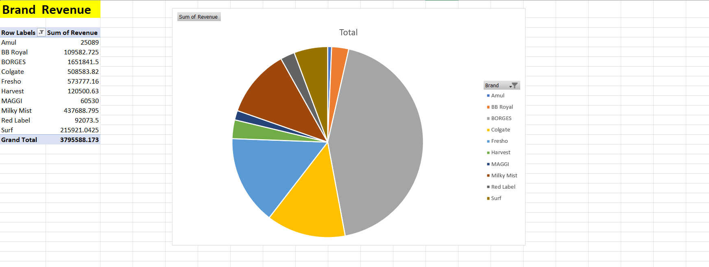

# E-commerce Sales Trends

## 📌 Objective
Analyze Indian e-commerce sales to identify:
- Top 10 products by revenue
- Monthly revenue trend
- Seasonal revenue
- Brand revenue

## 🛠 Tools Used
- Excel (data cleaning, pivot tables, charts)
- SQL (MySQL)

## 📊 Dataset
- File: ECOMMERCE_DATASET.csv
- Columns: InvoiceDate, Month, Season, Product Name, Brand, Price, Discount Price, Quantity, Revenue

  ## 📊 Excel Analysis
- [Pivot Tables & Charts](pivot_tables.xlsx)

## 🔎 Process
1. **Data Cleaning & Pivot Tables (Excel)**
   - Removed duplicates & missing values
   - Added `Revenue = Quantity * DiscountPrice`
   - Created Month and Season columns
   - Pivot tables created for top products, monthly trends, Seasonal revenue

2. **SQL Analysis**
   - Table creation: `sql_queries/create_table.sql`
   - Data insertion: `sql_queries/insert_data.sql`
   - Analysis queries: `sql_queries/queries.sql`
     - Top 10 products by revenue
     - Monthly revenue trend
     - Seasonal revenue trend
     - Brand revenue

3. **Visual Insights (Screenshots)**
   - Top Products: 
   - Monthly Trends: 
   - Seasonal Revenue: 
   - Brand Revenue: 

## 📈 Key Insights
- **Top 5 Products:** Olive Oil - Extra Virgin - Pack 3, Olive Oil - Extra Virgin - Pack 2, Olive Oil - Extra Virgin, Toothpaste - Colgate, Toothpaste - Colgate - Pack 3
- **Peak Month:** December
- **Peak Season:** Festive
- **Top Brand:** BORGES

## ✅ Outcome
- GitHub-ready project
- Dataset + Excel + SQL + Screenshots → complete analysis proof
- Actionable business insights included

